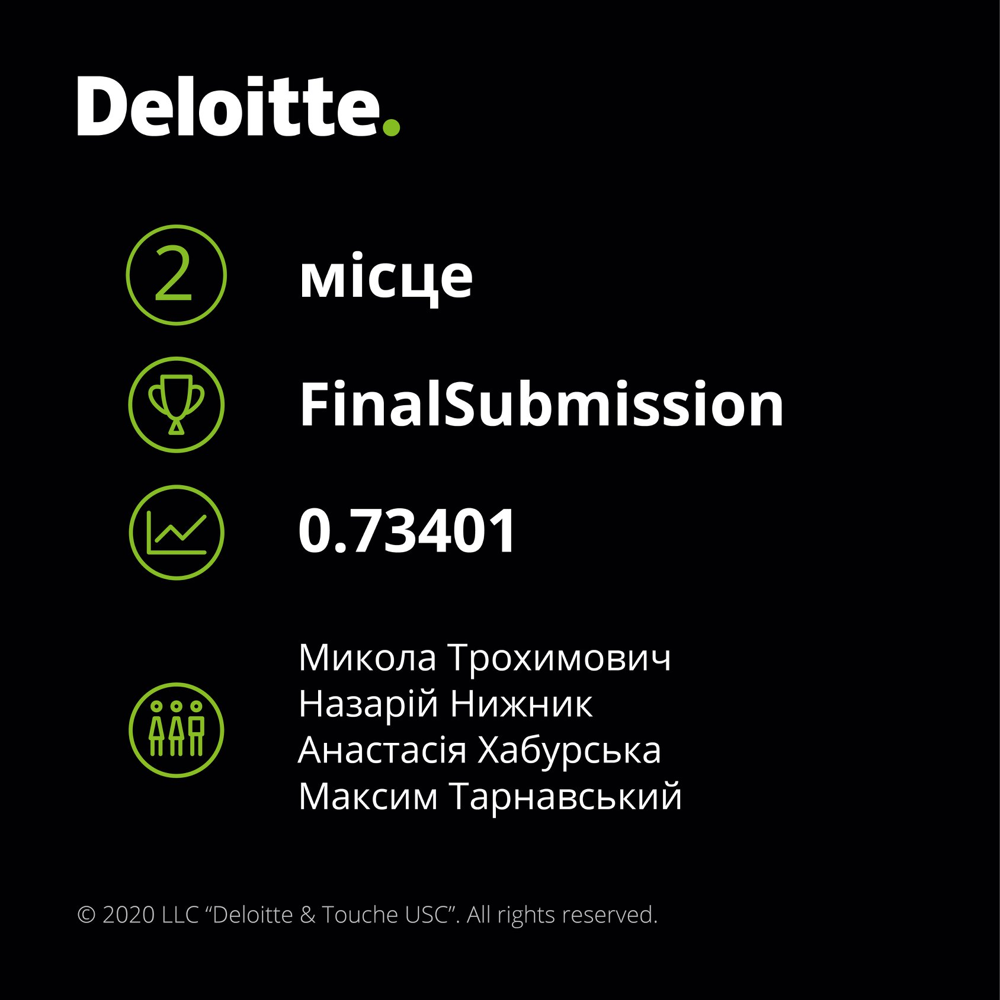

# Deloitte NLP hackathon

Text classification task (3 classes) with search criteria.

Finally we got acceptable results with two-level model 
(two binary random forest classifiers) used on bert-encoded text features
retrieved from text itself and 4 search criteria features.

Code created by:

- Mykola Trokhymovych
- Maxym Tarnavskyi
- Nazarii Nyzhnyk
- Anastasia Khaburska

Notice, that code is a bit dirty, because we didn't clean it enough during competition.

Two main points to see are [main_two_level](main_two_level.py) 
and feature extraction [notebook](notebooks/Models_for_bert_embedding_creation_for_specific_tasks.ipynb). 

